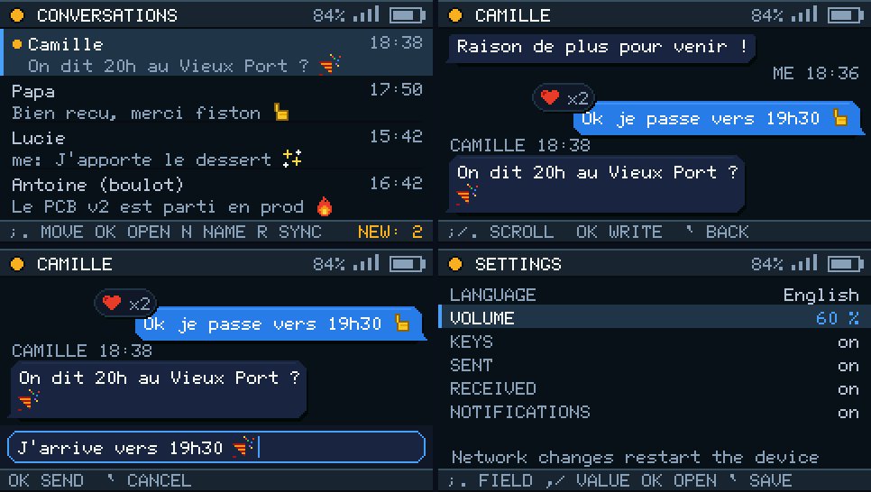
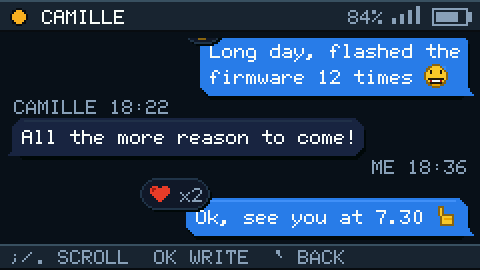
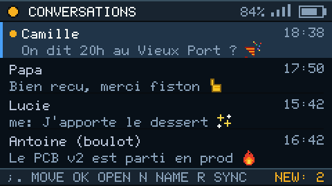
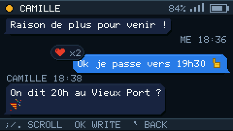
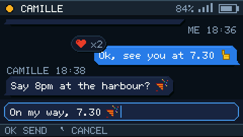
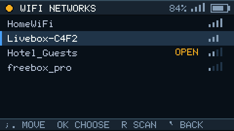
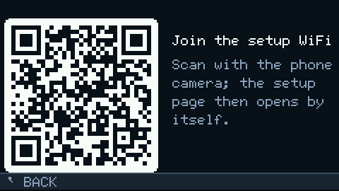
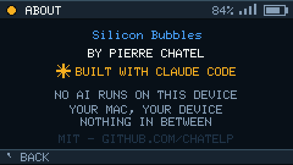

*[English](README.md) · **Français***

# Silicon Bubbles

**Un client iMessage de poche** — petit frère de [Silicon Casino](https://github.com/chatelp/geek-casino-cardputeradv).
M5Stack Cardputer ADV · ESP32-S3 · écran 240 × 135 · clavier 56 touches.



Un client léger pour [BlueBubbles](https://bluebubbles.app), la passerelle
iMessage open source (Apache-2.0) qui tourne sur un Mac. Le Cardputer
interroge son API REST en HTTPS, affiche les conversations en vraies bulles
et envoie des messages depuis son clavier physique. Pas d'application, pas
de compte, pas de nuage au milieu — votre Mac et votre appareil.

> ### ⚠️ À lire d'abord — il vous faut un serveur BlueBubbles
> Ce firmware est un **client**. Seul, il n'envoie de message à personne.
> Il lui faut le [serveur BlueBubbles](https://bluebubbles.app/install/)
> (gratuit, open source) sur un **Mac — ou Hackintosh / VM macOS —
> connecté à iMessage**, joignable depuis le Cardputer en réseau local ou
> en HTTPS. Installez-le d'abord — dix minutes, bien documenté — puis
> flashez ceci.
>
> Fonctionnement validé avec le serveur BlueBubbles **v1.9.9** (le plus
> récent à ce jour). Les serveurs plus anciens peuvent marcher ; non testés.

> ### 🚧 En chantier — votre installation est le test qui manque
> Ce firmware tourne au quotidien contre exactement **une** installation :
> un Cardputer ADV, un serveur v1.9.9 derrière Cloudflare, des numéros
> français. C'est un seul point de mesure. Si vous l'essayez — autres
> indicatifs, comptes riches en groupes, TLS auto-signé, ngrok, Cardputer
> d'origine —
> [ouvrez un ticket](https://github.com/chatelp/silicon-bubbles-cardputeradv/issues)
> en disant ce qui a marché et ce qui a coincé. En ce moment, un retour
> d'une installation différente de la mienne vaut plus que n'importe
> quelle fonctionnalité.



> Chaque image de ce README sort du simulateur — jamais d'une maquette.
> `pio run -e sim && .pio/build/sim/program --screens captures/screens`
> puis `python3 scripts/readme_images.py`.

---

## Ce qu'il fait

| | |
|---|---|
| **Conversations** | Liste fusionnée (une entrée par personne, pas par fil), aperçu, pastille non-lu |
| **Bulles** | Alignement gauche/droite, ergot, groupement par auteur, séparateurs horaires centrés |
| **Émojis** | 42 glyphes pixel couvrant 68 codepoints — jamais de carré vide |
| **Tapbacks** | Réactions affichées en pilule à cheval sur le coin de la bulle |
| **Envoi** | Private API ou AppleScript, avec un état honnête « parti mais non confirmé » |
| **Sons** | Cinq timbres de barre frappée, pas des bips — chacun désactivable |
| **Bilingue** | Anglais et français, au choix sur l'appareil ou dans le portail |

Texte seulement, par choix : les pièces jointes s'affichent
`[pièce jointe]`. Polling uniquement — ni Socket.IO, ni webhooks.

---

## Configuration, dans un navigateur

Au premier démarrage l'appareil ouvre un point d'accès : rejoignez
`SiliconBubbles` (mot de passe `bluebubbles`) et ouvrez `http://192.168.4.1`.
Ensuite, le même formulaire vit sur `http://cardputer.local`.

Tout se règle aussi **sur l'appareil** (Infos → `s`) : les réglages
numériques changent à chaud ; le WiFi (avec **scan des réseaux** — choisir
dans une liste, taper le mot de passe) et l'adresse/mot de passe du serveur
empruntent le même chemin sûr que le portail — enregistrés sur une copie,
puis l'appareil redémarre. Les deux chemins ne peuvent pas s'écraser en
silence : le portail refuse (HTTP 409) un formulaire rendu avant qu'un
réglage ne change sur l'appareil.

**Les QR codes** font travailler le téléphone : l'écran de premier
démarrage affiche un QR qui fait rejoindre le WiFi d'installation
(touche `OK`), et les réglages proposent un QR qui ouvre le portail à
l'adresse actuelle de l'appareil.

**Sauvegarde SD** (réglages → Sauvegarde sur SD) : configuration,
conversations épinglées, marqueur de synchro et noms de contacts partent
dans `/SiliconBubbles/` sur la microSD — flasher un firmware ne coûte plus
jamais votre configuration, et un appareil vierge propose la restauration
au premier démarrage (`b`). Les mots de passe y sont **en clair** : c'est
votre carte, traitez-la comme telle.

**Noms de contacts** : BlueBubbles ne pousse pas les contacts du Mac, la
liste affiche donc des numéros bruts. `n` sur une conversation lui donne
un nom local — stocké sur l'appareil, sauvegardé sur SD, jamais envoyé
nulle part.

Le mot de passe de votre serveur ne vit qu'en NVS sur l'appareil. Il n'est
jamais une valeur par défaut du firmware et n'entre jamais dans ce dépôt.

---

## Touches

| Touche | Liste | Conversation | Composition | Réglages |
|---|---|---|---|---|
| `;` `.` | naviguer | défiler, de bulle en bulle | — | changer de champ |
| `,` `/` | — | — | — | changer la valeur |
| `Entrée` | ouvrir | écrire | envoyer | — |
| `` ` `` | infos | retour | annuler | enregistrer et sortir |
| `r` | resynchroniser | — | — | — |
| `n` | nommer le contact | — | — | — |
| `Entrée` *(réglages)* | | | | ouvrir : scan WiFi, serveur, QR, sauvegarde SD |
| `p` / `s` | *(écran Infos)* tester le serveur / réglages | | | |

---

## Installer

**Le plus simple — [M5Burner](https://docs.m5stack.com/en/download)**
(aucun outillage à installer) : ouvrez M5Burner, catégorie **CARDPUTER**,
cherchez *Silicon Bubbles*, cliquez Burn. Attention, c'est une image
usine : elle **efface les réglages présents sur l'appareil**.

**Ou flashez le binaire de la release**
[v0.19.0](https://github.com/chatelp/silicon-bubbles-cardputeradv/releases/latest)
— l'image combinée s'écrit à l'adresse 0 :

```bash
esptool.py --chip esp32s3 write_flash 0x0 silicon-bubbles-0.19.0-factory.bin
```

Dans les deux cas, l'appareil demande ensuite le WiFi et votre serveur
BlueBubbles — voir *Configuration, dans un navigateur* plus haut.

---

## Compiler

Depuis les sources, ceci ne flashe que l'application et **préserve** vos
réglages :

```bash
pio run -e cardputer-adv -t upload
```

```bash
pio test -e test-native
```

La logique pure — décodage des flux HTTP, segmentation UTF-8 et émojis,
arrêts de défilement, analyse des tapbacks, clés de fusion des
conversations — vit dans des en-têtes de `include/` et est couverte par
34 tests natifs qui tournent sur votre machine, sans appareil branché. Sur
un écran de cette taille, ce banc d'essai est ce qui prouve la justesse.

---

## Prérequis

- Un serveur **BlueBubbles v1.9.9** fonctionnel — voir l'encadré du haut ;
  réseau local ou HTTPS (Cloudflare, ngrok, DNS dynamique)
- Un M5Stack **Cardputer ADV** — le Cardputer d'origine devrait convenir
  (même bibliothèque), non testé (un retour, dans un sens ou l'autre,
  aiderait !)

---

## Vérités matérielles

L'ESP32-S3FN8 n'a **pas de PSRAM**. Ce qui gouverne toutes les décisions
ici n'est ni les 8 Mo de flash ni les ~230 Ko de tas libre, mais le **plus
gros bloc contigu que le tas peut encore fournir en fonctionnement :
environ 31 Ko**. D'où des réponses analysées directement depuis la socket
TLS sans jamais bufferiser un corps, des requêtes paginées, et une doctrine
ratifiée — *la vitesse et l'UX priment sur l'exhaustivité* — à laquelle
toute nouvelle fonctionnalité doit répondre.

Les pièges qui ont coûté le plus cher sont consignés dans
[docs/02](docs/02_ARCHITECTURE.md), dont celui qui a été le plus long à
trouver : sur TLS, `NetworkClient::readBytes` traite une socket
momentanément vide comme une erreur fatale, tronquant en silence toute
réponse plus grosse que le tampon déchiffré.

---

## Les écrans

| | | |
|:--:|:--:|:--:|
|  |  |  |
| conversations | bulles, émojis, tapbacks | composition |
|  |  |  |
| scan WiFi, sur l'appareil | QR : le téléphone rejoint l'AP | à propos |

---

## Codes d'erreur

Les problèmes évidents affichent un message nu (« WiFi perdu »). Tout ce qui
touche au serveur BlueBubbles affiche un **code stable** à retrouver ici —
le détail technique va toujours sur la console série (115200), jamais à
l'écran.

| Code | Message | Cause probable — quoi vérifier |
|---|---|---|
| E11 | serveur injoignable | Adresse fausse, serveur éteint, ou appareil qui ne peut pas l'atteindre (VPN, VLAN, pare-feu). Essayez l'adresse dans un navigateur sur le même réseau. |
| E13 | serveur sans réponse | Connecté, mais pas de réponse à temps. Serveur surchargé ou lien très lent — souvent passager. |
| E20 | mot de passe serveur refusé | Le mot de passe du portail ne correspond pas à celui du serveur BlueBubbles (app Mac → API). |
| E21 | erreur côté serveur | Le serveur lui-même a échoué (5xx, code affiché). Voir les journaux du serveur sur le Mac. |
| E22 | API BlueBubbles introuvable | L'adresse répond, mais ce n'est pas une API BlueBubbles : mauvais chemin, reverse-proxy mal routé, ou serveur très ancien. |
| E23 | réponse HTTP inattendue | Quelque chose a répondu à la place du serveur (portail captif, proxy). Code affiché. |
| E30 | réponse aberrante | Le serveur annonce une réponse d'une taille absurde. Signalez-le — l'appareil s'est protégé. |
| E31 | réponse interrompue | La réponse est morte en plein transfert : lien instable entre l'appareil et le serveur. Souvent passager ; récurrent → vérifier le proxy. |
| E32 | réponse trop grosse (mémoire) | Réponse valide mais au-delà de la RAM de l'appareil. Baissez « messages chargés par conversation » dans le portail. |
| E40 | mémoire de l'appareil saturée | Momentané. L'appareil réessaie tout seul ; redémarrez si ça persiste. |
| E50 | adresse du serveur invalide | Doit commencer par `http://` ou `https://`, sans chemin final. |

La source de vérité est [`include/bb_errors.h`](include/bb_errors.h) — cette
table doit lui rester synchrone.

---

## Documentation

| | |
|---|---|
| [CLAUDE.md](CLAUDE.md) | doctrine du projet, garde-fous de périmètre |
| [docs/01](docs/01_DECISIONS.md) | journal des décisions, datées et actées |
| [docs/02](docs/02_ARCHITECTURE.md) | architecture, budget mémoire mesuré, pièges matériels |
| [docs/04](docs/04_ANALYSE_CHARGEMENT.md) | pourquoi `chat/query` est inutilisable, et ce qui le remplace |
| [docs/05](docs/05_DESIGN.md) | le langage visuel « encre et bulle » |
| [docs/06](docs/06_DOCTRINE_MEMOIRE.md) | doctrine mémoire et vitesse |

---

## Licence

[MIT](LICENSE) — prenez-le, apprenez-en, construisez dessus.

BlueBubbles est un projet indépendant sous Apache-2.0 : ce dépôt ne reprend
aucune ligne de son code et ne consomme que son API documentée. iMessage et
Apple sont des marques d'Apple Inc. ; ce projet n'est affilié ni à Apple ni
à BlueBubbles. Les bibliothèques tierces (M5Unified, M5GFX, ArduinoJson)
conservent leurs licences.
